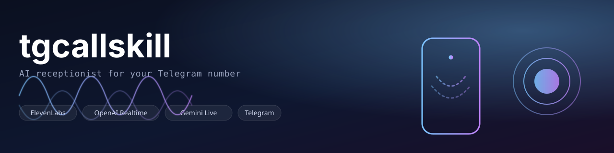
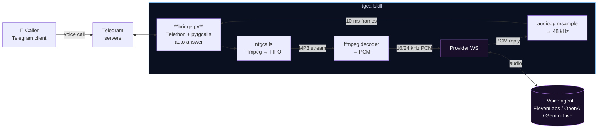

<div align="center">



# tgcallskill

**Auto-answer Telegram private calls with a real-time voice AI agent.**

Your Telegram phone number rings → an AI picks up and has a real two-way voice conversation with the caller.

[](https://www.python.org/)
[](https://github.com/astral-sh/uv)
[](https://core.telegram.org/mtproto)
[](https://elevenlabs.io/app/conversational-ai)
[](https://platform.openai.com/docs/guides/realtime)
[](https://ai.google.dev/api/multimodal-live)
[](#license)

[**Setup wizard →**](https://tele.lintware.com) &nbsp;·&nbsp; [**Live demo**](#-demo) &nbsp;·&nbsp; [**Architecture**](#-architecture) &nbsp;·&nbsp; [**Providers**](#-providers)

</div>

---

## ✨ What it does

- 📞 **Signs in to a Telegram account via MTProto** (Telethon session, OTP + optional 2FA).
- 🤖 **Auto-accepts every incoming voice call** to that account.
- 🎙️ **Bridges live call audio** to a real-time voice-AI provider so the AI can both **hear the caller** and **speak back** in real time.
- 🔌 **Provider-agnostic** — switch between **ElevenLabs Conversational AI**, **OpenAI Realtime**, or **Gemini Live** with a single `.env` value.

> Tested end-to-end. Caller dials your Telegram number, an AI receptionist answers and holds a natural conversation.

---

## 🚀 Quickstart

> **Platform support:** macOS · Linux · Windows (via WSL2). The runtime relies on Unix named pipes (`os.mkfifo`) and `/tmp` for the inbound-audio plumbing, so **Windows users must run inside [WSL2](https://learn.microsoft.com/windows/wsl/install)** — `wsl --install` from PowerShell, then follow the Linux steps below.

### 1. Install system deps

| OS                | One-liner                                                                                       |
|-------------------|-------------------------------------------------------------------------------------------------|
| **macOS**         | `brew install ffmpeg uv python@3.12`                                                            |
| **Linux** (Debian)| `sudo apt update && sudo apt install -y ffmpeg python3.12 && curl -LsSf https://astral.sh/uv/install.sh \| sh` |
| **Linux** (Arch)  | `sudo pacman -S ffmpeg python uv`                                                               |
| **Windows**       | In an admin PowerShell: `wsl --install -d Ubuntu` → reboot → open Ubuntu → run the Debian line above. |

### 2. Get the code & run

```bash
git clone https://github.com/vasanthsreeram/tgcallskill.git
cd tgcallskill
uv sync
cp .env.example .env       # fill in credentials, pick a VOICE_PROVIDER
uv run python login.py     # one-time: enter Telegram OTP and 2FA if set
uv run python bridge.py    # leave running — auto-answers every incoming call
```

Or **skip the form-filling**: paste your keys at **<https://tele.lintware.com>** — the wizard generates your `.env` and the exact commands to run.

---

## 🎬 Demo

```text
2026-05-17 16:17:28 INFO  INCOMING_CALL user=495589406
2026-05-17 16:17:28 INFO  EL ws opened chat=495589406
2026-05-17 16:17:29 INFO  AGENT: Hello! How can I help you today?
2026-05-17 16:17:29 INFO  ffmpeg decoder spawned pid=91376
2026-05-17 16:17:29 INFO  ntgcalls.record() started -> /tmp/peer_495589406_1779005849.mp3
2026-05-17 16:17:29 INFO  call fully armed (out + in)
2026-05-17 16:17:34 INFO  USER:  Hi, are you able to hear me?
2026-05-17 16:17:35 INFO  AGENT: Yes, I can hear you perfectly. How can I help?
2026-05-17 16:17:42 INFO  USER:  Tell me something about you.
2026-05-17 16:17:45 INFO  AGENT: I am an independent repair service…
2026-05-17 16:17:46 INFO  DISCARDED_CALL user=495589406
```

A real session log from the test run that shipped this release.

---

## 🔌 Providers

| Provider          | `VOICE_PROVIDER` | Input → Output rate | Required env                                                  |
|-------------------|------------------|---------------------|---------------------------------------------------------------|
| ElevenLabs Convai | `elevenlabs`     | 16 kHz → 16 kHz     | `ELEVENLABS_API_KEY`, `EL_AGENT_ID`                           |
| OpenAI Realtime   | `openai`         | 24 kHz → 24 kHz     | `OPENAI_API_KEY` (model + voice optional)                     |
| Gemini Live       | `gemini`         | 16 kHz → 24 kHz     | `GOOGLE_API_KEY` (model + voice optional)                     |
| xAI Grok          | `grok`           | —                   | Stub. No public realtime voice API yet; placeholder included. |

The bridge handles 48 kHz ↔ provider-rate resampling internally — you don't worry about formats.

Adding a new provider is a single file under `providers/` that implements `open / send_audio / recv / close`. See [`providers/base.py`](providers/base.py).

---

## 🧭 Architecture



### How the audio plumbing actually works

| Direction              | Path                                                                                                                                                                                       |
|------------------------|--------------------------------------------------------------------------------------------------------------------------------------------------------------------------------------------|
| **Caller → AI** (in)   | `pytgcalls.record(RecordStream(audio="/tmp/peer_<id>.mp3"))` → MP3 written to a **FIFO** → child `ffmpeg` decodes → PCM at provider rate → `provider.send_audio(...)`                       |
| **AI → Caller** (out)  | provider websocket emits PCM at `provider.output_rate` → `audioop.ratecv` upsamples to 48 kHz → 10 ms / 960 B chunks → `pytgcalls.send_frame(..., Device.MICROPHONE, chunk)`                |

> **Why the FIFO detour?** `on_frames` does not deliver private-call peer PCM in the current ntgcalls release. The FIFO+ffmpeg path is the working workaround.

---

## 🔧 Configuration

All knobs live in `.env`. See [`.env.example`](.env.example) for the full set; the essentials are:

```env
# Telegram (always required)
TG_API_ID=22053552
TG_API_HASH=ee9c…
TG_PHONE=+917881174135

# Pick one
VOICE_PROVIDER=elevenlabs        # elevenlabs | openai | gemini | grok

# ElevenLabs
ELEVENLABS_API_KEY=sk_…
EL_AGENT_ID=agent_xxx
```

Switch provider → edit `VOICE_PROVIDER` → restart `bridge.py`. That's it.

---

## 📁 Project layout

```
.
├── bridge.py                       # the runtime
├── login.py                        # one-time interactive Telethon auth
├── providers/
│   ├── base.py                     # Protocol every provider implements
│   ├── elevenlabs.py
│   ├── openai_realtime.py
│   ├── gemini_live.py
│   └── grok.py                     # stub
├── skill/tgcallskill/SKILL.md      # Claude Code skill metadata
├── site/                           # Cloudflare Pages setup wizard
│   └── public/index.html
├── docs/
│   └── banner.svg
└── .env.example
```

---

## 🩺 Troubleshooting

<details>
<summary><strong>Caller stuck on "exchanging encryption keys"</strong></summary>

You accepted MTProto signaling but never started the media plane. Make sure `pytgcalls.play(...)` runs inside the `INCOMING_CALL` handler, not just `phone.acceptCall`.
</details>

<details>
<summary><strong>The agent can't hear the caller</strong></summary>

You're missing `pytgcalls.record(RecordStream(audio="/tmp/…mp3"))` after `play(...)`. The `on_frames` callback does **not** fire for private-call peer audio — the FIFO+ffmpeg route is the workaround used here.
</details>

<details>
<summary><strong><code>Future attached to a different loop</code></strong></summary>

`PyTgCalls(tele)` captures the running asyncio loop on construction. Build it **inside** your `async def main()` rather than at module top level.
</details>

<details>
<summary><strong>Choppy outbound voice</strong></summary>

Variable-size frames or wrong cadence. Standardise on **10 ms = 960 B** at 48 kHz mono and tick the player every 10 ms.
</details>

<details>
<summary><strong>ElevenLabs <code>payment_required</code></strong></summary>

Free plan blocks premade library voices via API. Use a custom voice from your account, or upgrade.
</details>

<details>
<summary><strong>OpenAI Realtime 401 / 4xx</strong></summary>

Ensure the request carries both `Authorization: Bearer …` **and** `OpenAI-Beta: realtime=v1`.
</details>

<details>
<summary><strong>Gemini Live setup error</strong></summary>

Use a model name in the `models/gemini-2.0-flash-exp` family and a valid `prebuilt_voice_config` voice (e.g. `Aoede`, `Puck`).
</details>

---

## 🛡️ Privacy

- The hosted wizard at **<https://tele.lintware.com>** is a fully static page. Credentials never leave your browser.
- Your Telegram session file (`telecall.session`) stays on the machine running `bridge.py`. Don't commit it.
- The bridge stores no audio by default. Recording paths in the code are diagnostic only and are git-ignored.

---

## 📜 License

[MIT](LICENSE) — use at your own risk. Be courteous: tell the people calling you that they're talking to an AI.

---

<div align="center">
  <sub>Built with <a href="https://core.telegram.org/mtproto">MTProto</a> · <a href="https://github.com/pytgcalls/pytgcalls">pytgcalls</a> · <a href="https://docs.telethon.dev">Telethon</a> · ❤️ a few well-placed FIFOs.</sub>
</div>
